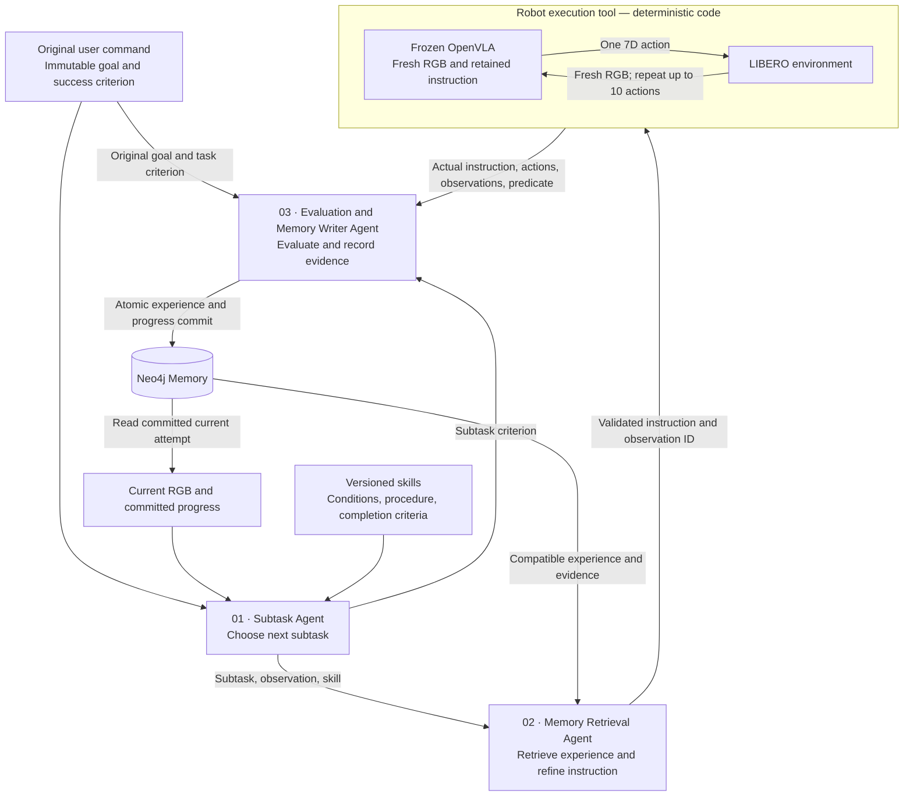

# ARMA implementation contract — minimal real demo

Accepted implementation specification, updated 2026-09-12 for the user-authorized A40 replacement and minimal real demo. This document defines required behavior; it is not evidence that every stage has run. See [implementation status](docs/implementation-log.md) for completed checks and blockers, and [setup](docs/setup.md) for executable commands. The superseded specification is preserved in [plan-before-astras.md](docs/plan-before-astras.md); its `every_action` cadence and undecided task/GPU choices are superseded by this contract.

## 1. Deliverable and fixed decisions

Build **ARMA — Agentic Robot Memory Architecture**: three agents use external procedures and recorded experience to guide a frozen OpenVLA policy. The demo shows real, recorded LIBERO executions, actual policy instructions, and the Neo4j experience paths that informed those instructions. Improvement is an experimental result, not an acceptance requirement to manufacture.

| Area | Fixed decision |
| --- | --- |
| Working branch | Preserve the current `qoder/test` checkout; `Astras` was the earlier requested branch. Do not switch it implicitly. Keep prior prototypes in `bin/`. |
| Intended development handoff | Qoder; record the actual tool used for each implementation session |
| Agent model | `gemini-3-flash-preview`, three separate system prompts and response schemas |
| Robot/environment | LIBERO fixed-base Franka Panda; MuJoCo/robosuite |
| Policy | `openvla/openvla-7b-finetuned-libero-spatial`, frozen |
| Task suite/order | `libero_spatial`, `task_order_index=0` |
| Task | `pick_up_the_black_bowl_from_table_center_and_place_it_on_the_plate` |
| Agent cadence | At most 10 policy actions per interval |
| Episode limit | 220 policy actions, excluding ten stabilization actions |
| Memory | Neo4j Aura Free; real execution experience only |
| Skills | Explicit versioned procedures, initially `pick_place_v1`; no automatic generation |
| Compute | One user-authorized RunPod A40 48 GB at a maximum $0.49/hour, 60 GB working volume, maximum six hours or earlier budget deadline |
| Demo | Recorded comparison and interactive evidence inspection |
| Total spending cap | US$10: compute/storage $5, model API $4, shutdown/uncertainty reserve $1 |

The latest user decision selects A40 again after the allocated L40S failed CUDA initialization and was deleted. The minimal five-episode scope still supersedes the original nine-episode initial evaluation. The attempted A40 replacement currently has no allocatable capacity; do not substitute another GPU or higher price automatically. Prepare the dependency container before renting the paid GPU. The preceding contract is preserved in [plan-before-l40s-minimal.md](docs/plan-before-l40s-minimal.md), and the actual L40S failure/deletion is recorded in the implementation log.

The checkpoint was already fine-tuned upstream for LIBERO. This project adds no post-training, LoRA, learned action correction, or model-internal hooks. The original model emits a single seven-dimensional action; ten repeated inferences are not a native action chunk. [Checkpoint](https://huggingface.co/openvla/openvla-7b-finetuned-libero-spatial)

Resolve the task by exact name from the installed suite and assert its existence. Do not depend on a numeric task ID. Reject arbitrary unsupported task commands. Use seed 7 and record the environment seed and reset state in the manifest.

## 2. Architecture and execution



The runner is deterministic routing, validation, sequencing, timeout, and persistence code, not a fourth agent. The original command reaches both the Planner and Evaluator. Keep original goal, current subtask, and actual policy instruction separate and traceable.

| Agent | Inputs | Responsibility/output |
| --- | --- | --- |
| Subtask | Original goal, RGB, committed progress, skill | Select/continue one registered stage and criterion |
| Retrieval | Subtask, RGB/context, compatible candidates | Keep/refine instruction; cite adopted and rejected experience |
| Evaluation/Writer | Original goal, subtask criterion, actual execution, before/after RGB, task predicate | Separate task/subtask outcomes; facts, hypotheses, evidence and progress |

All roles use the same Gemini model with separate prompts and Pydantic schemas. Retrieval has no experience-write tool. The Writer persistence path owns experience writes; deterministic lifecycle initialization/finalization is allowed.

`pick_place_v1` registers approach, grasp/lift, transport, and place/release. These conceptual stages contain no scripted joint actions or hidden coordinates. Preserve the complete original object-and-destination instruction; evidence-supported stage cues can supplement it. Primitive-command competence is not assumed.

### Interval lifecycle

1. Reset to the selected initialization state and apply ten official stabilization actions.
2. Create one `Attempt` with immutable goal and initial RGB.
3. Planner selects or continues one stage.
4. Deterministic Neo4j queries retrieve candidates; Retrieval Agent returns a validated instruction.
5. Worker repeats policy inference and environment execution up to ten times, using fresh RGB each time.
6. Check environment task success after every action and stop immediately on success.
7. Evaluator judges task/subtask outcomes using returned evidence.
8. Atomically persist the interval and Attempt progress, then read committed current state.
9. Repeat until terminal; close session, save video, synchronize artifacts.

Simulator stepping pauses during agent calls. Record wall time separately from video playback and simulator control frequency. Preserve upstream preprocessing, normalization, and gripper conversion. [Official evaluator](https://github.com/openvla/openvla/blob/main/experiments/robot/libero/run_libero_eval.py)

### State rules

- Initial Attempt: `status=running`, `outcome=null`, `step_index=0`, `decision_index=0`.
- `step_index` counts individual policy actions. `decision_index` counts intervals.
- Task predicate true: `completed/success/goal_satisfied`.
- 220 actions without success: `completed/failure/step_budget_exhausted`.
- Infrastructure failure or execution ambiguity: `completed/unknown`, with its interruption reason.
- A false predicate during an unfinished interval is not failure.
- Subtask outcome is separately `running/success/failure/unknown`; subtask success cannot terminate the task.
- The environment predicate is authoritative for whole-task success. Gemini cannot override it.
- If success is confirmed but Gemini fails, preserve success and mark explanation degraded.
- Unknown visual conditions remain unknown; uncertain causes belong in `cause_hypothesis`, not observed facts.
- After a terminal Attempt, a reset creates a new Attempt and optional `previous_attempt_id`; no reopening.

Use `simulator_assisted_task_rgb_planning`: environment task evaluation, RGB-based planning/retrieval, no hidden object poses supplied to agents. Record this boundary in each run.

## 3. Interfaces and deployment

Build and validate the dependency container before starting a paid GPU session. CPU-side dependency installation and image publication must finish first; GPU/EGL/policy smoke tests still require the eventual GPU and cannot be claimed by a successful container build. Record the immutable image digest.

Run two isolated Python environments on the same RunPod pod. Backend: Python 3.11, FastAPI, Pydantic v2, Google Gen AI SDK, Neo4j driver. Worker: Python 3.10.13, fixed OpenVLA/LIBERO dependencies. Bind worker HTTP to `127.0.0.1`; SSH provides local access. Shared pod filesystem makes artifact references readable by both environments.

Worker defaults: PyTorch 2.2.0/CUDA 12.1, Transformers 4.40.1, tokenizers 0.19.1, timm 0.9.10, FlashAttention 2.5.5, robosuite 1.4.1. Use EGL and validate a CUDA operation and a real RGB render before loading the policy. Save resolved dependency locks after successful setup. [Upstream dependencies](https://github.com/openvla/openvla/blob/main/pyproject.toml)

Include the prepared Python environments and pinned source checkouts in the image. Avoid compiling FlashAttention or installing the full dependency tree during paid demo time. Download any remaining checkpoint data into the working volume under the same storage budget and record its revision.

Pin audited OpenVLA commit `c8f03f48af692657d3060c19588038c7220e9af9` and LIBERO commit `8f1084e3132a39270c3a13ebe37270a43ece2a01`. Resolve and record the exact Hugging Face model revision before evaluation. Record source commits, checkpoint revision, package locks, prompts/hashes, skill version, perception mode, seed, initialization state, and configuration in a run manifest.

### Robot HTTP API

| Endpoint | Contract |
| --- | --- |
| `POST /sessions/reset` | Task/reset request; returns session ID, observation and manifest |
| `POST /sessions/{id}/execute` | Execute one bounded interval with retained instruction |
| `GET /sessions/{id}/executions/{execution_id}` | Recover execution state/result after timeout |
| `POST /sessions/{id}/close` | Close environment and return saved video reference |
| `GET /health` | Model, GPU, renderer and environment readiness |

`ResetRequest`: `attempt_id`, `init_state_id`, `seed=7`, exact supported `task_name`.

`ExecutionRequest`: `attempt_id`, `execution_id`, `expected_step_index`, `observation_id`, `executed_instruction`, `max_actions=min(10, remaining_actions)`.

`ExecutionResult`: `execution_id`, `start_step_index`, `end_step_index`, before/after observation IDs and records, `actual_instruction`, `actions`, `task_success`, `termination_reason`, `artifact_refs`, `elapsed_ms`.

Each action event contains its index, `raw_policy_action`, `env_action`, `resulting_observation_id`, `evidence_id`, and `rgb_ref`. Each observation records ID, step, RGB reference, evidence ID, hash, and task predicate.

Duplicate execution IDs with identical payloads return saved results; conflicting payloads are rejected. Validate current step and observation before execution. On timeout, query status rather than repeating actions. An unrecoverable worker crash makes the Attempt unknown.

### Agent contracts

Every response includes `attempt_id`, `decision_index`, `based_on_step`, `observation_id` and rejects extra fields. See [typed agent contracts](arma/contracts.py) and [worker protocol](worker/protocol.py).

- `PlannerDecision`: stage, subtask goal, registered criterion, skill/version, `continue/set_subtask/stop`, reason.
- `RetrievalDecision`: `keep/adapt/request_replan`, actual instruction, source decision IDs, evidence IDs, candidate adoption decisions and reasons.
- `EvaluationRecord`: independent task/subtask outcomes and judgment sources, task/subtask evidence references, observed facts, nullable cause hypothesis, conditions, degraded flag.

Each normal interval makes three role calls. Allow one schema-repair call; reserve its API cost. Permit at most two replanning cycles without action. Reject stale IDs, invented evidence, unsupported criteria and goal-changing instructions. Empty/incompatible memory keeps the full valid original instruction.

## 4. Neo4j schema and persistence

Preserve these Attempt fields:

```text
attempt_id, step_index, task_goal, success_criteria, initial_context,
executed_instruction, status, outcome, termination_reason,
latest_observation_ref, evidence_refs, judgment_source, observed_facts,
cause_hypothesis, previous_attempt_id
```

Add decision index and run metadata: robot, task, initialization state, seed, policy revision, prompts, perception mode, split, provenance, memory snapshot, timestamps and costs.

| Entity | Stored meaning |
| --- | --- |
| Run, Task, Attempt | Experiment configuration and episode identity |
| DecisionStep | Planner, retrieval, evaluation and execution interval |
| StepEvent | One action and observation references |
| ContextObservation | Time-specific registered condition with true/false/unknown value |
| Instruction | Actual instruction and content hash |
| Evidence | Artifact URI, hash, media type and source |
| Skill | Explicit authored procedure and version |

```text
Run —HAS_ATTEMPT→ Attempt —FOR_TASK→ Task
Attempt —HAS_DECISION→ DecisionStep —HAS_ACTION→ StepEvent
DecisionStep —USED_SKILL→ Skill
DecisionStep —USED_INSTRUCTION→ Instruction
DecisionStep —HAS_CONTEXT→ ContextObservation
DecisionStep —HAS_EVIDENCE→ Evidence
DecisionStep —RETRIEVED→ historical DecisionStep
Attempt —RETRY_OF→ previous Attempt
```

`RETRIEVED` stores adoption and reason. `RETRY_OF` means temporal retry, not proven causality. Serialize nested agent payloads as JSON strings and expose indexed/searchable values as properties or nodes. Store media bytes outside Neo4j.

Create unique ID constraints for each entity. Use immutable IDs and payload hashes. Store interval records, evidence, action references and Attempt progress in one transaction. Never execute actions or call Gemini inside a retried transaction. Persist a local outbox before commit, pause on persistence failure, and retry only the same record. Use causal consistency for the current-state read following commit.

### Historical retrieval

All candidate and expanded retry nodes must satisfy:

```text
Attempt completed with outcome success or failure
provenance == real_execution
dataset_split == memory_build
member of the frozen snapshot
same task, robot, policy and perception mode
```

Retrieve historical DecisionSteps, not only the Attempt's final instruction. Rank subtask compatibility, known matching conditions and evidence availability; unknowns do not match. Exclude known conflicting conditions. Return at most three candidates. From relevant failures traverse incoming `RETRY_OF` up to three hops, applying the same eligibility rules to every expansion.

The demonstration is a failure → real retry → outcome evidence path, with context and actual instruction differences inspectable. Use parameterized Cypher through the driver. Vector embeddings, GDS, arbitrary model-written Cypher and automatic skill synthesis are outside v1. MCP is optional development tooling, not required in the control loop.

## 5. Recorded comparison, replay and budget

### Experimental design

| Condition | Purpose |
| --- | --- |
| `baseline` | Frozen policy with official full instruction; integration reference |
| `agents_no_memory` | Three-agent control with historical candidate list empty |
| `agents_memory` | Same system with eligible historical retrieval enabled |

Keep weights, registry, prompts, observation boundary, action budget, seeds, initial states and cadence equal between agent conditions. Disabled retrieval still records real execution.

The initial paid demo is deliberately small: one official-instruction baseline smoke on state 4; two real no-memory collection attempts on states 0 and 1; then one held-out state-10 comparison pair (`agents_no_memory`, `agents_memory`). This is **five required real episodes**, including collection and baseline. It is not a nine-episode benchmark.

Allow at most one additional actual retry of a failed collection attempt, selecting the lowest failed state index and only if the remaining budget covers it. Record the original failure, retry link, instructions and evidence. Do not invent a failure to make the graph interesting. Freeze eligible successful/failed real collection IDs before state-10 evaluation; evaluation writes never enter that snapshot.

Keep policy weights, registry, role prompts, observation boundary, action budget and initialization state equal between the held-out pair. Keep memory/no-memory results even when neither improves. If the budget cannot cover the complete pair, stop and record incomplete coverage; do not present an unpaired run as a comparison. Expansion to states 11 and 12 and a full nine-episode comparison is future work after the minimal demo, subject to remaining budget and explicit scheduling.

### Portable replay

Show side-by-side agent condition videos, original goal, selected stage, actual instruction, action/decision counters, results, costs, wall time, retrieved graph, evidence frames and candidate reasons. Show every held-out result in a table. Label selection rules for illustrative pairs. Keep real/synthetic provenance visible on each Attempt; do not prefill performance claims.

Export graph, records and copied media to `index.html`, CSS/JS, `bundle.json`, `bundle.js`, and `assets/`. The replay works without the GPU/database and without third-party web dependencies. See [exporter](arma/replay.py). Bundle version is `"1"` with `generated_at`, `attempts`, `graph.nodes`, `graph.edges`, and `selection_note`. Nodes contain `id`, `label`, `properties`; edges contain `source`, `target`, `type`, `properties`.

### Spending safeguards

Total cap: $10. Reserve $5 compute/storage, $4 API, $1 shutdown/uncertainty. The user explicitly authorized an A40 48 GB replacement at a maximum $0.49/hour after the L40S host failed and was deleted. Recheck A40 price and allocatable capacity immediately before creation; a regional LOW availability label is not proof that creation will succeed. Do not silently exceed the price or change GPU. One 60 GB working volume; maximum six hours, reduced if costs require it.

Track API input, output, thinking and retry tokens. Planning rates: $0.50/million text/image input and $3/million output; verify before paid execution. Reserve bounded estimated cost before every call; keep reservations on ambiguous failures. Check affordability before starting experiment groups. [Gemini pricing](https://ai.google.dev/gemini-api/docs/pricing)

Synchronize artifacts after every Attempt; verify local copies before terminating the pod and deleting its disposable storage. Stopping compute alone may leave storage billing. [RunPod storage](https://docs.runpod.io/pods/storage/types)

## 6. Delivery stages and acceptance

1. Repository/contracts: preserve the current branch and prototypes, secret exclusions, schemas, runner, budget ledger, fake worker. Pass: complete mock loop with no duplicate action.
2. Memory/skills: Aura Free connection, constraints, atomic persistence, bounded retrieval and skill registry. Pass: graph demonstrates matching, exclusions and retry evidence; test fixtures remain synthetic.
3. Policy baseline: CUDA and EGL checks, frozen checkpoint inference, official-instruction episode, video and manifest. Pass: actual policy action and real environment evidence saved.
4. Agent integration: Gemini images and structured responses; real ten-action interval through all roles. Pass: correct observations and immutable goal reach evaluator, evidence is stored in Neo4j.
5. Collection/demo: baseline smoke4, real collection states0/1, frozen snapshot, held-out state10 pair and portable export. Pass: instructions trace to actual retrieved evidence; all reported successes have task-predicate support.

Required regressions: subtask success does not imply task success; success on action three ends an interval; fresh RGB on every inference; empty/incompatible memory preserves goal; stale observations and duplicate execution IDs do not add actions; DB retries do not rerun robot; unknown stays unknown; evaluation cannot leak into memory; evaluator failure preserves confirmed success; budget exhaustion stops paid dispatch; replay assets survive removal of the worker source directory.

Complete implementation means the real system, evidence chain and reproducible comparison run successfully. Unit tests, a synthetic smoke, or an accepted plan alone do not establish this. Record validation and blockers in the implementation log. Copy this contract into the user-requested Notion page after checking existing content; verify the written page afterward.
