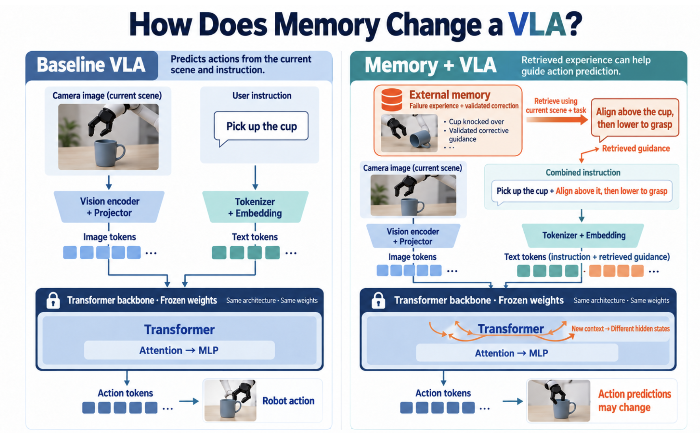
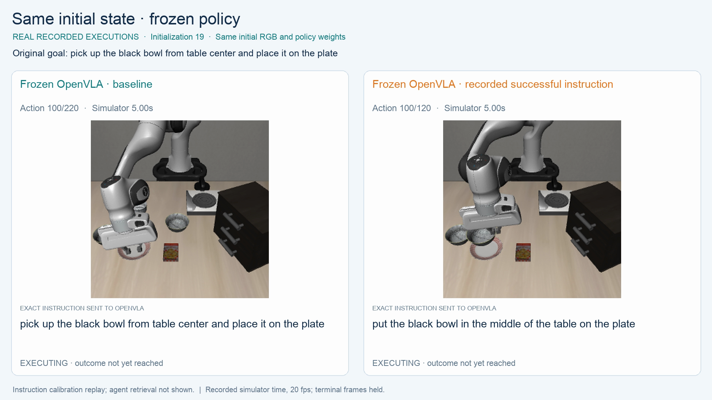
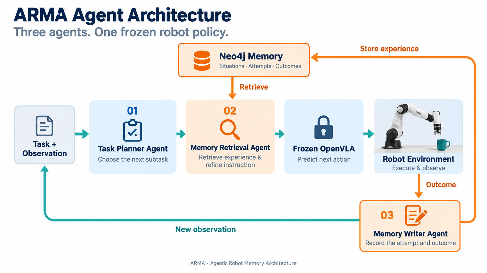

# ARMA — Agentic Robot Memory Architecture

> External memory for a frozen robot policy: retrieve prior experience, refine the instruction, execute, evaluate, and remember—without retraining OpenVLA.



## Why ARMA?

A baseline VLA sees the current image and instruction but does not remember previous attempts. ARMA connects a frozen OpenVLA policy to a Neo4j experience graph so three agents can plan the next subtask, retrieve compatible prior evidence, refine the policy instruction, and record the result.

The goal is to help a robot avoid repeating known mistakes without another GPU training cycle.

## Recorded demo

[](demo/instruction-comparison.mp4)

The video above uses **real OpenVLA inference in LIBERO on a RunPod L40S**, with the same initial state and frozen weights on both sides. The original instruction exhausted 220 actions; a directly calibrated instruction completed the task in 120 actions.

This proves that instruction context can change frozen-policy behavior. It does **not** prove that agent memory caused the success: the successful instruction was calibrated directly. See the [baseline video, exact results, and validation boundary](demo/README.md).

## Architecture



1. **Task Planner Agent** selects the next subtask from the goal and current observation.
2. **Memory Retrieval Agent** queries a frozen Neo4j snapshot for task-, robot-, policy-, and perception-compatible attempts, then keeps or refines the instruction.
3. **Memory Writer Agent** evaluates the new evidence and transactionally records the attempt, decisions, actions, and outcome.
4. **Frozen OpenVLA** alone predicts robot actions; ARMA changes context, not model weights.

## What actually ran

| Component | Recorded result |
| --- | --- |
| RunPod GPU | NVIDIA L40S; CUDA BF16 and headless EGL rendering passed |
| Frozen OpenVLA baseline | LIBERO state 4 success after **134 actions / 14 intervals** |
| Gemini agents | Real multimodal planner, retrieval, and evaluator calls recorded |
| Neo4j Aura memory | Live writes, retrieval, graph export, and reconciliation passed |
| Local verification | **164 tests passed** |

Real agents-with-memory episodes retrieved recorded sources and changed policy instructions/actions, but the evaluated episodes did not succeed. ARMA therefore makes **no success-rate improvement claim**. The full evidence boundary is in [Validation](docs/validation.md).

## Run on RunPod

Use a CUDA-enabled RunPod image with persistent `/workspace` storage. The tested GPU was an NVIDIA L40S 48 GB; do not reinstall the host driver or CUDA inside the Pod.

### 1. Clone and install

```sh
cd /workspace
git clone --branch qoder/test --single-branch \
  https://github.com/Sehyeogkim/qoder_noe4j_hackarthon.git arma
cd arma

nvidia-smi
command -v uv >/dev/null || curl -LsSf https://astral.sh/uv/install.sh | sh
export PATH="$HOME/.local/bin:$PATH"
bash scripts/setup_backend.sh
bash scripts/setup_worker.sh
```

### 2. Validate the GPU and renderer

```sh
export ARMA_VENDOR_ROOT=/workspace/arma/vendor
export ARMA_WORKER_VENV=/workspace/arma/worker-venv
export PYTHONPATH=/workspace/arma:/workspace/arma/vendor/openvla
export HF_HOME=/workspace/arma/hf-cache
export MUJOCO_GL=egl PYOPENGL_PLATFORM=egl
export CUDA_VISIBLE_DEVICES=0 MUJOCO_EGL_DEVICE_ID=0

python worker/gpu_preflight.py --expected-gpu "NVIDIA L40S"
"$ARMA_WORKER_VENV/bin/python" -m worker.smoke
```

### 3. Start one frozen-policy worker

```sh
export ARMA_WORKER_MODE=real
export ARMA_ARTIFACT_DIR=/workspace/arma/artifacts/gpu-baseline/worker
export ARMA_HF_REVISION=962318cec55ac10993ff0f5f43eda9a270b4c873

"$ARMA_WORKER_VENV/bin/python" -m worker.serve \
  --host 127.0.0.1 --port 18001
```

Keep port `18001` private. In a second Pod terminal:

```sh
cd /workspace/arma
curl --fail --silent http://127.0.0.1:18001/health

/workspace/arma/backend-venv/bin/python scripts/run_gpu_baseline.py \
  --worker-url http://127.0.0.1:18001 \
  --artifacts artifacts/gpu-baseline \
  --init-state 4
```

For Gemini and Neo4j runs, copy `.env.example` to `.env`, add credentials only on the Pod, and follow [Setup](docs/setup.md). Never commit credentials.

<details>
<summary>Optional Docker BuildKit image</summary>

```sh
DOCKER_BUILDKIT=1 docker build --platform linux/amd64 \
  --build-arg ARMA_CUDA_ARCH=8.9 \
  --build-arg "ARMA_EXPECTED_GPU=NVIDIA L40S" \
  -f containers/Dockerfile -t arma-worker:l40s .
```

The recipe is checked in, but this image build was not verified in the current checkout. See [container notes](containers/README.md).

</details>
## Project map

| Path | Purpose |
| --- | --- |
| [`arma/`](arma/) | Agent contracts, orchestration loop, budget, Neo4j memory, and replay export |
| [`worker/`](worker/) | Frozen OpenVLA + LIBERO process and local HTTP boundary |
| [`prompts/`](prompts/) | Versioned planner, retrieval, and evaluator system prompts |
| [`scripts/`](scripts/) | Setup, baseline, agent demo, probes, import, and export entrypoints |
| [`configs/`](configs/) | Fixed experiment and calibration protocols |
| [`demo/`](demo/) | Compact public recordings and exact result summary |
| [`docs/`](docs/) | Validation, experiment design, memory schema, and reproducibility notes |
| [`tests/`](tests/) | Contract, retrieval, recovery, replay, and safety regression tests |

<details>
<summary>Developer-only local contract test</summary>

This uses fake agents and a fake robot to validate the software loop. It is not the RunPod/OpenVLA experiment.

```sh
uv venv --python 3.11 .venv
uv pip install --python .venv/bin/python -e '.[test]'
.venv/bin/python -m pytest -q
.venv/bin/python -m arma.cli --artifacts artifacts/synthetic smoke --output replay-output
```

</details>
