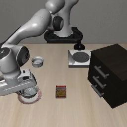

# Recorded demo evidence

These files are a small, reviewable subset of the full local execution archive. Every recording comes from real OpenVLA inference in the LIBERO simulator on a RunPod L40S GPU; none is physical-robot footage.

## Frozen OpenVLA baseline

[Watch the recorded baseline](openvla-baseline-success.mp4)

- Task: pick up the black bowl from the table center and place it on the plate.
- Initialization state: 4.
- Result: success after 134 policy actions across 14 intervals.
- Environment: LIBERO with a simulated Franka Panda.
- Agents / external memory: disabled for this baseline.

## Instruction-sensitivity comparison

[Watch the same-state comparison](instruction-comparison.mp4)

This side-by-side recording uses the same initial state and frozen policy weights. The original instruction exhausted the 220-action budget; a separately calibrated instruction completed the simulator task in 120 actions.

This comparison establishes that instruction wording can change the frozen policy's behavior. The successful instruction was tested directly, not retrieved by the three-agent system, so this is not evidence that memory caused an improvement or that the result generalizes to unseen states.

## Validation boundary

The full local archive contains action-level observations, hashes, agent records, and Neo4j exports but is intentionally excluded from Git because it is approximately 428 MB. The repository publishes only these compact recordings and the summary needed to evaluate the project honestly.

