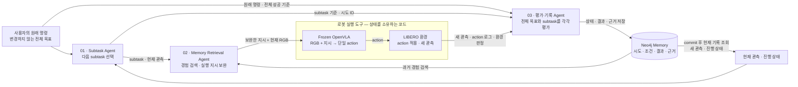
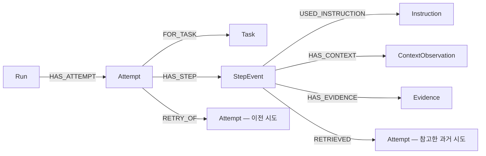

# ARMA — Qoder 구현 명세

작성 기준: 2026-09-12. 이 문서는 Qoder에 전달할 구현 지시서다. 현재 저장소의 HTML 화면은 설계용 합성 데이터로 동작하며, 실제 LLM·OpenVLA·LIBERO·Neo4j 연결 및 성공률 검증이 끝난 상태가 아니다.

## 0. Qoder에 먼저 전달할 지시

이 저장소에서 ARMA — Agentic Robot Memory Architecture를 구현하라. 아래 확정된 구조를 유지하고, 단계별 완료 기준을 통과한 뒤 다음 단계로 진행하라. 별도의 네 번째 의사결정 agent를 만들지 말고, 세 agent를 연결하는 runner는 결정적인 실행 코드로 작성하라. 테스트용 mock과 실제 API·시뮬레이션 실행을 화면과 로그에서 명확히 구분하라. 실제 모델 실행을 하지 않고 성공률 개선이나 로봇 실행 완료를 주장하지 말라.

구현 전 현재 파일과 `agent.md`, 적용되는 `AGENTS.md`를 읽고 사용자 작업을 보존하라. 본문에 제안된 신규 파일이 이미 존재하면 먼저 내용을 읽고 통합하라. 기존 HTML 비교 화면을 삭제하지 말라. Qoder에서 작성·실행한 변경과 검증을 `docs/implementation-log.md`에 남겨라. 이 PLAN 자체는 구현 완료 증거가 아니다.

## 1. 목표와 고정 범위

목표는 고정된 VLA가 수행한 성공·실패 경험을 Neo4j에 기록하고, 이후 관련 경험을 검색해 실행 지시를 보완하는 시스템을 만드는 것이다. 개선 여부는 동일한 작업·초기 상태·실행 예산에서 비교한다.

확정된 제품 구조:
- Subtask Agent: 원래 목표와 현재 상태를 보고 다음 subtask를 선택한다.
- Memory Retrieval Agent: 경험을 검색하고, 현재 subtask를 수행할 짧은 지시를 보완한다.
- 평가·기록 Agent, 즉 Memory Writer Agent: 원래 사용자 명령과 subtask 기준을 실행 결과와 비교하고 성공·실패·진행 상태 및 근거를 기록한다.
- 원본 OpenVLA의 LIBERO용 fine-tuned checkpoint를 추론 전용으로 사용한다. LoRA, fine-tuning, action 보정 학습, 모델 내부 feature hook을 추가하지 않는다.
- 로봇은 LIBERO의 고정형 Franka Panda다. OpenVLA는 현재 RGB 한 장과 지시를 받아 단일 7D action을 출력한다. OpenVLA-OFT나 action chunk 모델로 임의 교체하지 않는다.
- Neo4j는 실제 경험 저장·검색에 사용한다. 데모 화면에서 검색 근거 관계를 표시한다.
- LLM 모델 계열은 사용자가 선택한 Gemini 3 Flash다. 정확한 API ID와 계정 접근은 시작 시 검증한다.

이번 MVP 밖의 항목: 실제 하드웨어 제어, 바퀴·허리 제어, 새로운 simulator 장면 제작, 학습을 통한 새로운 운동 능력 추가, 자동 skill 배포, GDS community detection 및 graph 최단 경로를 이용한 운동 계획.

## 2. 확정 설계와 구현 기본값을 구분한다

아래 값은 재현 가능한 첫 구현을 위한 기본 제안이다. 사용자와 이미 확정된 사실처럼 기록하지 말고 `configs/demo.yaml`에 명시하라.
- task suite·task ID·checkpoint revision: 첫 baseline 검사에서 선택하고 manifest에 고정한다. 임의의 물체 이름이나 존재하지 않는 LIBERO task를 만들지 않는다.
- orchestration: Python + FastAPI + Pydantic v2. LLM 호출은 Google Gen AI SDK, DB는 Neo4j Python driver. 별도 agent framework는 필수가 아니다.
- GPU worker: OpenVLA와 LIBERO를 동일한 Linux/CUDA worker 프로세스에 두어 모델 출력과 환경 상태의 소유권을 하나로 유지한다.
- UI: 현재 HTML/CSS/JS 자산의 스타일을 재사용하는 독립 `web/` 화면. 복잡한 프런트엔드 framework 도입은 첫 MVP의 필수 조건이 아니다.
- perception mode: 첫 개발은 `simulator_assisted`로 수행한다. 환경에서 확인 가능한 성공 판정과 지정한 상태 기반 조건을 사용하며 UI에 이 모드를 표시한다. `rgb_only`와 결과를 섞지 않는다.
- agent cadence: 현재 논의한 구조를 그대로 검증하기 위해 기본은 `every_action`. `robot.step` 한 번은 모델 추론 한 번과 환경 action 한 번이다. 이벤트 주기 호출·여러 action 묶음은 별도 실험 설정이며 기본 동작을 몰래 바꾸지 않는다.
- 배포 및 GPU 공급자: 미정. 기존 사용 가능한 실행 환경을 확인한다. 이 문서를 이유로 유료 GPU나 DB 인스턴스를 자동 생성하지 않는다.

## 3. 최종 아키텍처



중요한 입력 경계:
- `original_goal`은 사용자 입력 이후 immutable이다. Planner와 Evaluator에 모두 전달한다. Retrieval Agent가 작성한 `executed_instruction`으로 덮어쓰지 않는다.
- `subtask_goal`은 현재 단계의 목표다. subtask가 성공해도 전체 사용자 목표가 성공한 것은 아니다.
- `executed_instruction`은 이번 action을 위해 OpenVLA에 보낸 실제 문자열이다. 원래 목표, subtask, 실행 지시 세 개를 항상 함께 추적한다.
- Memory Retrieval Agent가 전체 목표나 subtask 순서를 변경하지 않는다. 계획 변경이 필요하면 `request_replan` 결과를 반환해 Planner가 결정한다.
- 평가·기록 Agent의 판정 근거 전체는 Neo4j에 저장한다. 다음 판단에는 저장된 최신 상태와 관측 참조를 전달한다. 동일한 결과를 서로 다른 두 저장소에서 임의로 갱신하지 않는다.
- 그림의 role들은 논리적인 세 agent다. 동일한 Gemini 모델을 서로 다른 system prompt·입출력 schema로 호출해도 된다. 서로 다른 GPU나 세 개의 OS 프로세스가 필요한 것은 아니다.

## 4. 실행 단위와 상태 머신

용어를 코드와 DB에서 통일한다.
- `Run`: 한 번의 실행 요청 또는 평가 설정. task suite, checkpoint, LLM, memory snapshot, seed, 실행 모드를 고정한다.
- `Attempt`: 원래 전체 작업 목표를 한 초기 상태에서 수행하는 한 번의 trial. 성공, 실행 한도, 오류, 취소로 종료된다.
- `Subtask`: Attempt 내부 단계. Planner가 선택하며 subtask 변경만으로 새 Attempt를 만들지 않는다.
- `StepEvent`: 한 번의 OpenVLA action 및 그 전후 관측·agent 결정·평가 기록.
- 새로운 reset으로 다시 시도하면 새 `attempt_id`를 만들고 `previous_attempt_id`로 연결한다. 기존 환경 상태에서 계속하거나 복구 지시를 바꾸는 것은 같은 Attempt 내의 새 StepEvent다.

Attempt 상태:
- 초기 관측 준비 후 `status=running`, `outcome=null`, `step_index=0`.
- 다음 action 실행·평가·저장 성공 시 `step_index`가 정확히 1 증가한다.
- 전체 작업 성공: `status=completed`, `outcome=success`, `termination_reason=goal_satisfied`.
- 전체 성공이 확인되지 않은 채 명시한 action 예산 종료: `completed/failure/step_budget_exhausted`.
- API 장애, worker 상태 불명, 사용자 취소 등으로 작업 결과를 알 수 없음: `completed/unknown`과 구체적 종료 이유. 장애를 로봇의 운동 실패로 학습 기억에 섞지 않는다.
- 종료된 Attempt는 다시 running으로 열지 않는다. 정정이 필요하면 변경 이유와 revision을 기록하는 별도 관리 경로를 둔다.

Subtask 상태는 `running/success/failure/unknown`으로 별도 기록한다. 컵을 들었지만 아직 접시에 놓지 않았다면 `subtask_outcome=success`, `task_outcome=null`일 수 있다. 전체 성공은 매 평가 시 원래 목표 기준으로 확인한다.

## 5. 세 agent의 상세 계약

### 5.1 Subtask Agent

입력: 원래 사용자 명령, 불변 task 계약, 현재 RGB 또는 명시된 관측 요약, 현재 subtask, 마지막 평가, 남은 실행 예산, 검증된 subtask 목록.

출력은 `PlannerDecision` JSON만 허용한다.
```json
{
  "attempt_id": "attempt_012",
  "based_on_step": 0,
  "decision": "continue",
  "subtask_id": "subtask_01",
  "subtask_goal": "pick up the target cup",
  "criterion_id": "target_grasped",
  "reason": "The current subtask has not been completed."
}
```

`decision`은 `continue/set_subtask/stop` 중 하나다. 위 컵 예시는 계약 설명용이며 실제 task manifest의 물체 이름을 사용한다. `criterion_id`는 코드에 등록한 조건 ID만 허용한다. 첫 baseline에서 세부 지시 수행이 확인되지 않으면 전체 원래 목표를 단일 subtask로 유지한다. Planner가 임의로 만든 좌표, action, 물리 능력을 실행하지 않는다.

System prompt에 넣을 규칙:
- 원래 명령을 보존하고 현재 관측·마지막 평가에 근거해 한 단계만 선택한다.
- 지원되는 subtask·criterion만 사용한다. 완료 근거가 없으면 완료했다고 말하지 않는다.
- 과거 경험 검색과 최종 OpenVLA 지시 보완은 Retrieval Agent에 맡긴다.
- 전체 작업 성공의 최종 판정은 Evaluator 계약과 환경 기준에 따른다.

### 5.2 Memory Retrieval Agent

입력: 원래 목표, PlannerDecision, 현재 관측 ID·조건 snapshot, robot/policy ID, memory snapshot, 허용된 검색 도구.

도구:
- `memory.get_attempt(attempt_id)`: 이번 시도의 정확한 상태·최신 관측 조회.
- `memory.get_current_state(attempt_id, expected_step_index)`: commit된 step과 평가·관측을 정확하게 조회한다. runtime도 이 계약을 사용한다.
- `memory.search_experiences(query)`: 현재와 호환되는 과거 시도 후보 검색.
- `memory.get_evidence(evidence_id)`: 필요한 근거 metadata 및 읽을 수 있는 asset 참조 반환.
- `robot.step(request)`: 최종 검증을 통과한 지시로 한 번 실행. side effect가 있는 호출은 runtime이 한 번만 수행한다.

검색은 최소한 `policy_id`, `robot_id`, `perception_mode`, 평가용 snapshot을 제한한다. 유사도만으로 적용 가능성을 확정하지 않는다. 후보의 적용 조건과 근거를 검사하고 채택·제외 이유를 남긴다.

출력:
```json
{
  "attempt_id": "attempt_012",
  "based_on_step": 0,
  "subtask_id": "subtask_01",
  "decision": "keep",
  "executed_instruction": "pick up the target cup",
  "source_attempt_ids": [],
  "rejected_candidates": [],
  "evidence_ids": [],
  "reason": "No compatible prior experience was retrieved."
}
```

`decision`은 `keep/adapt/request_replan`이다. 검색된 기억이 없거나 조건이 불확실하면 `keep`을 기본으로 사용한다. `request_replan`은 action을 실행하지 않고 제한된 재계획 루프로 돌아간다. 예를 들어 한 observation에서 최대 2회 재계획 후 해결되지 않으면 명시적 중단 상태로 종료한다. 같은 관측에서 무한 대화하지 않는다.

최종 지시는 짧은 영어 작업 지시로 작성하고 원래 대상과 목표 관계를 바꾸지 않는다. 실행 기록 전체, JSON, DB 설명을 OpenVLA prompt에 붙이지 않는다. 모델의 언어 반응은 별도 gate에서 확인한다.

### 5.3 평가·기록 Agent

입력에는 다음 항목이 모두 있어야 한다.
- `original_goal`과 전체 task의 고정 성공 기준.
- 현재 subtask 및 그 `criterion_id`.
- 실제로 실행한 지시, action, action 전후 관측.
- simulator의 명시적 작업 성공 신호, 사용 가능한 상태 기반 조건 결과.
- `attempt_id`, `step_index`, `action_id`, 남은 action 예산.

Evaluator는 환경 판정과 영상 해석의 출처를 구분한다. 환경의 최종 목표 판정과 충돌하는 LLM 출력은 그대로 저장·실행하지 않고 validation error로 다룬다. 실행 중인 동작을 한 프레임만 보고 실패로 확정하지 않는다. RGB만으로 확인할 수 없는 접촉력·마찰 원인을 확정하지 않는다.

출력:
```json
{
  "attempt_id": "attempt_012",
  "step_index": 1,
  "subtask_outcome": "running",
  "task_outcome": null,
  "attempt_status": "running",
  "termination_reason": null,
  "judgment_source": "simulator_task_predicate",
  "task_judgment_source": "simulator_task_predicate",
  "subtask_judgment_source": "vlm_inference",
  "observed_facts": [],
  "cause_hypothesis": null,
  "evidence_refs": ["frame_001", "step_001_log"]
}
```

Writer Agent는 `memory.record_step` 또는 `memory.finalize_attempt` 도구를 사용한다. JSON 검증과 transaction 처리는 도구 코드가 맡는다. 원인 가설은 근거·불확실성을 포함하는 별도 필드로 저장한다. 성공 사례에도 원인 가설이 반드시 필요한 것은 아니다. task와 subtask가 다른 판정 출처를 사용할 수 있으므로 실제 계약에는 `task_judgment_source`, `subtask_judgment_source`, `task_evidence_refs`, `subtask_evidence_refs`를 각각 둔다. 기존 `judgment_source`는 Attempt 전체 task의 대표 출처이며 두 출처를 덮어쓰는 필드가 아니다.

## 6. 데이터 전달과 순서 — 가장 먼저 구현할 runtime

Runtime은 routing·validation·lock·timeout을 담당하는 코드이며 독립적인 판단 agent가 아니다. 한 Attempt에는 동시에 하나의 action만 실행한다.

```python
# 개념 의사코드: 아래 함수들은 Qoder가 구현해야 한다.
task = load_and_validate_task_manifest(config)
ctx = robot.reset(task, init_state_id=config.init_state_id)
attempt = memory.start_attempt(original_goal=task.original_goal, observation=ctx)
last_evaluation = None

while attempt.status == "running":
    planner = subtask_agent.decide(task, ctx, last_evaluation)
    validate_planner_decision(planner, ctx)
    if planner.decision == "stop":
        finalize_as_cancelled_or_unknown()  # Planner의 주장만으로 success 처리 금지
        break

    retrieval = retrieval_agent.decide(task, planner, ctx, memory_tools)
    validate_retrieval_decision(retrieval, ctx)
    if retrieval.decision == "request_replan":
        handle_bounded_replan_without_action()
        continue

    action_id = make_action_id(attempt.id, ctx.step_index + 1)
    result = robot.step(action_id, ctx.observation_id, retrieval.executed_instruction)
    evaluation = evaluator.evaluate(task.original_goal, planner, retrieval, result)
    validated = validate_against_environment_and_budget(evaluation, result)
    receipt = memory.record_step_and_update_attempt(result, validated)
    committed = memory.get_current_state(
        attempt.id, expected_step_index=result.step_index, bookmark=receipt.bookmark
    )
    # Restore feedback from the committed record, not the raw agent response.
    ctx, last_evaluation, attempt = restore_feedback(committed)
```

초기화에서는 `last_evaluation=None`으로 시작한다. `based_on_step`과 `observation_id`가 최신 환경 버전과 다르면 해당 결정을 거부한다. simulation은 외부 agent 판단을 기다리는 동안 추가 `env.step`을 호출하지 않는다. 실제 로봇 실시간 제어로 일반화했다고 주장하지 않는다.

매 action 이후 evaluation이 끝나야 다음 step으로 간다. 한 Attempt가 completed가 될 때까지 다음 관측을 기다리게 구현하면 교착이 생긴다. step 저장 완료와 task 종료는 다른 이벤트다.

## 7. Robot tool / GPU worker 계약

Worker가 모델 인스턴스, 환경 인스턴스, 현재 관측, step counter, action idempotency ledger를 소유한다. 하나의 시뮬레이션 세션은 하나의 worker에 귀속된다.

필수 API:
- `GET /health`: 모델 로딩·GPU·환경 준비 여부 및 버전. secret은 반환하지 않는다.
- `POST /sessions/reset`: suite/task/init_state/seed를 검증하고 초기화·settling 후 첫 관측 반환.
- `POST /sessions/{id}/step`: 현재 observation ID, instruction, action_id로 추론 및 한 action 실행.
- `GET /sessions/{id}/actions/{action_id}`: timeout 후 이미 실행됐는지 확인.
- `POST /sessions/{id}/close`: 종료·자원 해제. 모델을 매 action마다 다시 로드하지 않는다.

StepRequest:
```json
{
  "attempt_id": "attempt_012",
  "action_id": "attempt_012:1",
  "expected_step_index": 0,
  "observation_id": "obs_012_000",
  "executed_instruction": "pick up the target cup"
}
```

Worker는 `observation_id`를 자신이 보유한 최신 RGB로 해석한다. Tool call의 이미지 참조와 실제 VLA 입력을 일치시킨다. 오래된 RGB와 새 환경을 조합하지 않는다. SDK에서 필요한 이미지 bytes는 이 참조를 읽어 전달한다.

StepResult는 `action_id`, 전후 observation ID, `step_index=1`, raw model action, 실제 env action, reward, 환경 종료/성공 신호, 이미지·상태 로그 참조, elapsed time을 반환한다. action은 길이 7의 유한 수치여야 한다. 모델 출력 좌표계·단위·정규화·gripper convention은 worker manifest에 명시한다. 다른 정책의 action convention을 혼용하지 않는다.

같은 action_id 재요청은 환경 action을 다시 실행하지 않고 기존 결과를 반환한다. 첫 요청과 다른 instruction이나 observation을 같은 action_id로 보내면 충돌 오류다. worker가 action을 적용했지만 결과 저장 전에 죽어 상태를 복원할 수 없다면 `unknown`으로 종료한다. 무작정 재실행하지 않는다.

## 8. 성공 판정 및 관측 계약

전체 성공 기준은 LIBERO의 선택한 task 정의에 연결한다. runner가 사용자 명령과 다른 benchmark 목표를 실행하지 않도록, MVP에서는 UI에서 고른 task의 공식 instruction을 원래 명령으로 사용한다. 자유 입력 명령은 검증된 task/목표와 매핑될 때만 실행하고, 매핑이 불명확하면 실행 전에 unsupported로 반환한다.

`criterion_registry.py`에는 허용된 criterion_id와 evaluator 함수를 등록한다. LLM이 Python/Cypher 식을 생성해 실행하게 하지 않는다. Subtask 기준이 환경에서 확인 가능하지 않으면 이미지 모델의 판단을 `judgment_source=vlm_inference`로 기록하고, 불확실하면 unknown으로 남긴다.

관측 객체 필드:
```json
{
  "observation_id": "obs_012_001",
  "attempt_id": "attempt_012",
  "step_index": 1,
  "rgb_ref": "artifacts/attempt_012/frames/000001.png",
  "timestamp": "2026-09-12T20:00:00Z",
  "perception_mode": "simulator_assisted",
  "task_success": false,
  "predicate_results": {},
  "state_log_ref": "artifacts/attempt_012/steps/000001.json"
}
```

메타데이터가 아닌 이미지 내용을 LLM이 인지하려면 실제 image bytes를 이미지 입력으로 보내야 한다. 파일 경로를 prompt에 적는 것만으로 모델이 사진을 읽었다고 취급하지 않는다. 관측 참조의 파일은 backend와 worker가 읽을 수 있는 artifact API 또는 명시된 shared storage로 연결한다.

## 9. Memory schema — 기존 15개 필드 유지

Attempt의 논리 JSON 계약은 아래 필드를 유지한다. Neo4j 저장 형식과 API 응답 형식은 adapter에서 변환한다.
- `attempt_id`: 유일한 시도 ID.
- `step_index`: 마지막으로 commit된 step. 초기값 0.
- `task_goal`: 원래 사용자 명령. 변경 금지.
- `success_criteria`: 전체 task 기준과 version.
- `initial_context`: 실행 시작 시의 상황 snapshot.
- `executed_instruction`: 가장 최근 실행 지시. 전체 이력은 StepEvent에 남긴다.
- `status`: running 또는 completed.
- `outcome`: running에서는 null; completed에서는 success/failure/unknown.
- `termination_reason`: 종료 사유; 진행 중에는 null.
- `latest_observation_ref`: 마지막 commit 관측 참조.
- `evidence_refs`: 판정 근거 ID 목록.
- `judgment_source`: 판정 출처.
- `observed_facts`: 관측으로 확인한 사실.
- `cause_hypothesis`: 원인 추정과 근거·불확실성; 모르면 null.
- `previous_attempt_id`: reset 후 재시도인 경우 이전 Attempt ID.

구현에 필요한 추가 metadata:
`run_id`, `task_id`, `suite`, `init_state_id`, `seed`, `robot_id`, `policy_id`, `checkpoint_revision`, `llm_model`, `prompt_version`, `schema_version`, `perception_mode`, `memory_snapshot_id`, `dataset_split`, `provenance`, `started_at`, `ended_at`, `revision`.

provenance는 최소 `synthetic/real_execution/replay`를 구분한다. 실제 평가 검색에서 synthetic 예시를 제외한다. replay 영상은 새로운 물리 실행 결과가 아니다.

## 10. Neo4j graph model

첫 구현의 노드는 Run, Task, Attempt, StepEvent, ContextObservation, Evidence, Instruction으로 제한한다. Outcome은 Attempt 속성으로 두어 시작한다. 현재 HTML에 있는 Episode/Outcome 등 다른 초안과 이름을 혼용하지 말고 이 명세의 대응표를 README에 남긴다.



- ContextObservation은 특정 관측 시점에 귀속된다. 동일 물체의 과거 위치나 조건을 최신 전역 사실로 덮어쓰지 않는다.
- ContextObservation은 `predicate`, `subject_role`, `object_role`, `truth_value=true/false/unknown`, `source`, `observation_id`, `observed_at`, `evidence_id`를 가진다. 실제로 추출·검증한 조건만 채운다.
- Instruction은 본문과 내용 hash, 생성 주체·prompt version을 가진다. 같은 본문을 재사용해도 어떤 step에서 선택됐는지는 StepEvent에 남긴다.
- StepEvent는 action_id, step_index, subtask_id, subtask_goal, criterion_id, planner/retrieval/evaluator 결정, action 전후 참조와 지연 시간을 보존한다.
- `RETRY_OF`는 재시도 관계다. 수정 지시가 성공의 원인임을 증명하는 `CAUSED_SUCCESS` 관계를 만들지 않는다.
- `RETRIEVED` 관계에는 채택 여부·유사도·선택 이유를 넣는다. 검색됐다는 사실과 실제 채택을 구분한다.
- 이미지·영상 bytes를 Neo4j에 직접 넣지 않는다. Evidence에 URI, hash, type, observation_id, 출처를 저장한다.
- Neo4j property에는 임의 nested JSON map을 그대로 저장할 수 없다. `initial_context`, `success_criteria`, `cause_hypothesis`, agent decision 등 복합 값은 JSON 문자열로 직렬화하거나 위 노드로 정규화하고 API에서 복원한다. 실제 검색 조건은 별도 스칼라 속성/노드로 추출한다.

## 11. Neo4j 구현 — 제약·쓰기·검색

### 11.1 공통 메시지와 저장 규칙

위 JSON은 역할 설명을 위한 축약 예시다. 실제 Pydantic 모델에는 공통 envelope로 `schema_version`, `run_id`, `attempt_id`, `based_on_observation_id`를 포함한다. action 이후 메시지는 `action_id`, `step_index`, `observation_after_id`도 필수다. agent 응답의 ID가 요청과 일치하는지 runtime에서 검증한다.

DB 속성 이름은 snake_case로 통일한다. `original_goal`은 agent/Run 계약의 명칭이고 Attempt의 `task_goal`에 동일한 원문을 저장한다. 복합 필드는 `success_criteria_json`, `initial_context_json`, `observed_facts_json`, `cause_hypothesis_json`, `decision_json`처럼 저장한다. `evidence_refs`처럼 동종 문자열 목록은 property로 저장할 수 있다. hash는 canonical JSON에서 계산한다.

초기 migration에 아래 unique constraint를 넣는다. 설치한 Neo4j 버전에서 migration을 실제 실행해 검증한다.
```cypher
CREATE CONSTRAINT run_id_unique IF NOT EXISTS
FOR (n:Run) REQUIRE n.run_id IS UNIQUE;
CREATE CONSTRAINT task_id_unique IF NOT EXISTS
FOR (n:Task) REQUIRE n.task_id IS UNIQUE;
CREATE CONSTRAINT attempt_id_unique IF NOT EXISTS
FOR (n:Attempt) REQUIRE n.attempt_id IS UNIQUE;
CREATE CONSTRAINT step_event_id_unique IF NOT EXISTS
FOR (n:StepEvent) REQUIRE n.event_id IS UNIQUE;
CREATE CONSTRAINT instruction_id_unique IF NOT EXISTS
FOR (n:Instruction) REQUIRE n.instruction_id IS UNIQUE;
CREATE CONSTRAINT context_id_unique IF NOT EXISTS
FOR (n:ContextObservation) REQUIRE n.context_id IS UNIQUE;
CREATE CONSTRAINT evidence_id_unique IF NOT EXISTS
FOR (n:Evidence) REQUIRE n.evidence_id IS UNIQUE;
```

`MERGE`는 불변 ID로만 수행한다. outcome, 지시 본문, timestamp 같은 변경 가능 속성을 identity에 넣지 않는다. 예를 들어 `MERGE (a:Attempt {attempt_id: $attempt_id})` 이후 허용된 필드만 갱신한다. raw model JSON을 `SET a += $payload`로 무검증 저장하지 않는다.

### 11.2 한 step의 원자적 저장

쓰기 순서는 worker action 결과를 durable ledger에 저장 → backend artifact/JSONL 기록 → 검증된 evaluation 생성 → Neo4j transaction → 저장 완료 feedback 순서다.

하나의 transaction에서 StepEvent, Instruction, ContextObservation, Evidence 및 관계를 저장하고 Attempt의 마지막 step·관측·판정·terminal 상태를 함께 갱신한다. 관계는 MERGE하고 event ID는 `attempt_id:step_index`로 유일하게 만든다. 같은 event ID와 같은 payload hash 재전송은 기존 결과 반환, 다른 hash는 충돌이다. 이전 step/revision을 검사해 순서가 뒤바뀐 저장을 거부한다. 동일 Attempt의 쓰기는 runner lock으로 직렬화한다.

Neo4j driver의 `execute_write` callback은 자동 재시도될 수 있다. 이 callback 안에서 LLM API, `env.step`, artifact upload, 새로운 UUID 생성을 수행하지 않는다. ID·payload는 callback 밖에서 확정한다. DB 장애에서는 같은 record 저장만 재시도한다. 이미 실행한 로봇 action을 반복하지 않는다.

쓰기 commit 후 현재 상태를 다시 읽는 경로는 같은 session 또는 bookmark를 전달해 일관성을 유지한다. 저장이 실패하면 다음 action을 보류하고 `persistence_blocked` 실행 상태를 UI에 표시한다. 일정 시간 후 복구 불가하면 별도 로컬 종료 기록을 남긴다. DB가 복구되면 그 기록을 재처리한다.

### 11.3 현재 상태 조회와 과거 검색

현재 Attempt 조회는 정확한 ID lookup이다. 이는 과거 유사 사례 검색으로 대체할 수 없다.
```cypher
MATCH (a:Attempt {attempt_id: $attempt_id})
OPTIONAL MATCH (a)-[:HAS_STEP]->(s:StepEvent {step_index: a.step_index})
RETURN a, s;
```

MVP의 과거 검색은 vector index 없이 시작한다. 다음 query는 후보 선별의 기본 예시이며 migration/fixture에서 실행 검증 후 사용한다.
```cypher
MATCH (a:Attempt)-[:FOR_TASK]->(t:Task)
WHERE a.status = 'completed'
  AND a.outcome IN ['success', 'failure']
  AND a.provenance = 'real_execution'
  AND a.dataset_split = 'memory_build'
  AND a.attempt_id IN $snapshot_attempt_ids
  AND a.attempt_id <> $current_attempt_id
  AND a.policy_id = $policy_id
  AND a.robot_id = $robot_id
  AND a.perception_mode = $perception_mode
  AND t.task_family = $task_family
RETURN a.attempt_id AS attempt_id, a.outcome AS outcome,
       a.initial_context_json AS initial_context_json,
       a.ended_at AS ended_at
ORDER BY ended_at DESC, attempt_id ASC
LIMIT $candidate_limit;
```

`policy_id`는 checkpoint repository·revision·normalization key·action adapter version을 포함한 고정 identity다. MVP의 task_family는 task manifest에서 직접 지정한다. 관련 없는 작업으로 검색이 넓어지지 않게 첫 gate에서는 같은 task_id로 추가 제한하고, 교차 task 검색은 이후 별도 실험으로 연다.

후보 Attempt의 StepEvent와 당시 ContextObservation을 가져와 현재 subtask·물체 역할·관측 가능한 조건을 비교한다. 초기 상태만 같다는 이유로 중간 단계 경험을 적용하지 않는다. 최종 채택 근거에는 반드시 `source_attempt_id`, `source_event_id`, 해당 instruction과 evidence ID를 포함한다. Attempt의 마지막 instruction만 읽어 성공 전략이라고 요약하지 않는다.

첫 ranking 기본값:
- 필수 호환성: robot/policy/perception/snapshot/task 범위 일치. 알려진 핵심 조건 충돌이면 제외한다.
- 후보 최대 20개, LLM에 전달하는 후보 최대 3개. manifest에서 조정 가능하게 한다.
- 조건 일치 수, 같은 subtask 여부, 근거 존재 여부로 결정적인 순서를 정하고 동점은 ID로 정렬한다. 점수를 성공 확률이라고 표시하지 않는다.
- 알려지지 않은 조건은 일치로 세지 않는다. 적용 가능한 후보가 없으면 빈 결과를 반환한다.

### 11.4 Neo4j를 사용하는 데모 기능

기본 데모는 `현재 상황 → 관련 실패 → 실제 후속 재시도 → 그때의 지시와 결과 → 이번 지시에 반영` 경로를 보여준다. `RETRY_OF`는 새 Attempt에서 이전 Attempt로 향하므로, 과거 실패의 후속 재시도는 역방향으로 최대 1–3 hop만 탐색한다. 확장된 모든 노드에도 동일한 policy·snapshot·split·provenance 제한을 적용한다. 성공 노드가 없으면 성공 복구가 발견됐다고 표시하지 않는다.

UI는 backend가 반환한 노드/관계만 그린다. 현재 선택한 기억의 evidence를 클릭하면 당시 RGB와 실제 지시·판정 출처를 보여준다. 이것이 그래프의 첫 유용한 기능이다. 단순히 Neo4j 로고를 붙인 JSON 저장 데모로 끝내지 않는다.

후속 확장 순서:
1. 구조화 검색 + bounded graph traversal을 실제로 동작시킨다.
2. 기억 수가 늘어 검색 누락이 확인되면 text summary embedding으로 vector 후보 검색을 추가하고 동일한 필터·graph 확장을 적용한다. 모델명·차원·버전·index 상태를 명시한다. 텍스트 embedding을 RGB의 시각 embedding으로 설명하지 않는다.
3. Neo4j GraphRAG retriever를 도입한다면 기존 repository 인터페이스 안에서 교체한다. 새 agent를 추가하지 않는다.

Neo4j MCP는 개발 중 schema 확인·read query 검사 도구로 선택적으로 쓸 수 있다. MVP runtime의 필수 의존성은 Neo4j driver다. 자유로운 `write-cypher`를 LLM에 주지 않는다. MCP가 세 agent나 memory schema를 자동으로 만들어 주는 것은 아니다.

## 12. Gemini 3 Flash 연결과 prompt

2026-09-12 공식 문서에서 확인한 API ID는 `gemini-3-flash-preview`다. Preview 모델이므로 구현 시작 시 모델 조회와 실제 이미지+JSON smoke를 실행한다. 접근 실패 시 다른 모델로 조용히 바꾸지 말고 오류와 설정값을 표시한다.

SDK는 `google-genai`를 사용한다. orchestration 환경에서 설치·검증한 버전을 lock한다. 세 role은 같은 client adapter를 공유하되 각각 별도 system prompt와 response model을 사용한다.

다음은 API 사용 방식의 예시다. 키나 실제 이미지 없이 이 문서 작성 단계에서 inference를 수행한 것은 아니다.
```python
import json
import os
from pathlib import Path
from google import genai
from google.genai import types
from pydantic import BaseModel, ConfigDict

class EvaluationNote(BaseModel):
    model_config = ConfigDict(extra="forbid")
    observation_id: str
    observed_facts: list[str]
    evidence_refs: list[str]

client = genai.Client(
    api_key=os.environ["GEMINI_API_KEY"],
    http_options=types.HttpOptions(
        timeout=30_000,
        retry_options=types.HttpRetryOptions(
            attempts=3, initial_delay=1, max_delay=4,
            http_status_codes=[408, 429, 500, 502, 503, 504],
        ),
    ),
)
image_bytes = Path("artifacts/smoke/frame.png").read_bytes()
response = client.models.generate_content(
    model=os.environ["GEMINI_MODEL"],
    contents=[types.Content(role="user", parts=[
        types.Part.from_text(text=json.dumps({
            "observation_id": "smoke_001",
            "allowed_evidence_ids": ["frame_smoke_001"],
            "task": "Describe only facts visible in this frame."
        })),
        types.Part.from_bytes(data=image_bytes, mime_type="image/png"),
    ])],
    config=types.GenerateContentConfig(
        system_instruction="Return only the requested JSON. Do not invent evidence IDs.",
        response_mime_type="application/json",
        response_json_schema=EvaluationNote.model_json_schema(),
        max_output_tokens=2048,
    ),
)
if not response.text:
    raise RuntimeError("Gemini returned no structured response")
note = EvaluationNote.model_validate_json(response.text)
```

실제 runtime에서는 위 축약 EvaluationNote를 5절의 완전한 계약으로 확장한다. 각 결과의 enum, ID, evidence 존재, 목표 보존, 최신 관측 버전은 Pydantic 외의 semantic validator에서도 검사한다.

호출 정책 기본값:
- model metadata 조회는 `client.models.get(model=...)`. generateContent 지원 여부 확인만으로 이미지 inference·quota 검증을 완료했다고 하지 않는다.
- API timeout 30초, 시도 최대 총 3회. 위 예제처럼 SDK retry를 명시적으로 설정하고 application에서 같은 transport 오류를 다시 감싸 재시도하지 않는다. production adapter는 설정값을 이 옵션에 매핑한다. backoff 동작은 설치한 SDK 버전에서 검증한다.
- 잘못된 JSON은 동일 입력·evidence로 최대 1회 repair한다. 없는 evidence, 바뀐 attempt_id, 임의 criterion은 실행에 사용하지 않는다.
- 이미지 1장 또는 전후 2장을 명시된 ID와 함께 전달한다. 로그에는 image hash와 prompt version을 남긴다. 응답 latency·token usage·retry count를 수집한다.
- 외부 DB 기억의 문자열은 과거 데이터다. 그 안에 있는 지시를 system prompt로 승격하지 않는다.

구현은 structured output + 명시적 tool dispatcher를 기본으로 한다. Retrieval의 검색 조건 JSON → 코드의 parameterized Cypher → 검색 결과 → 지시 보완 JSON 순서다. robot action과 memory write를 SDK 자동 함수 호출에 직접 등록해 반복 실행되게 만들지 않는다.

prompt 파일은 `prompts/subtask_v1.md`, `prompts/retrieval_v1.md`, `prompts/evaluator_v1.md`로 버전 관리한다. 각각 5절의 책임·금지 변경·출력 계약을 포함한다. Evaluator prompt에는 “원래 목표 기준의 전체 성공과 현재 subtask 성공을 분리하고, 관측 사실과 원인 가설을 분리하라”를 넣는다.

세 agent가 항상 세 API 호출을 의미하지는 않는다. 현재 검색 조건 생성과 지시 보완을 분리하면 한 action에 Planner 1회 + Retrieval 2회 + Evaluator 1회로 기본 4회다. 220 actions이면 최대 880회에 retry/repair/replan이 추가된다. 첫 실제 5–10 steps에서 지연 시간과 token 사용량을 측정해 예상 전체 소요를 계산하고 wall-clock budget을 실행 전에 고정한다. 느리다는 이유로 여러 action을 묶거나 agent cadence를 자동으로 바꾸지 않는다.

환경이 이미 `task_success=true`를 반환했다면 LLM 설명 생성 장애 때문에 확인된 성공을 unknown으로 낮추지 않는다. 코드가 환경 근거로 success를 기록하고 `evaluation_degraded=true`, `llm_error`를 별도 남긴다. 반대로 환경이 성공을 확인하지 않았는데 LLM만 success라고 하면 success로 승격하지 않는다. 일반 LLM 오류가 최종 운동 실패의 근거가 되지 않게 한다.

## 13. OpenVLA + LIBERO worker 구현

### 13.1 첫 baseline 선택

첫 후보는 공식 `libero_spatial` suite와 `openvla/openvla-7b-finetuned-libero-spatial` checkpoint다. 이는 구현 기본 제안이며, 사용할 task ID·instruction·init_state는 설치된 suite에서 실제 목록을 읽어 하나를 선택한다. 선택을 `configs/tasks/<task_id>.yaml`과 run manifest에 고정한다. 공식 저자가 이미 LIBERO용으로 학습한 checkpoint를 사용하는 것이며 이 프로젝트가 추가 학습하는 것은 아니다.

고정할 항목: OpenVLA git SHA, LIBERO git SHA, Hugging Face checkpoint revision, task suite/name/ID, init_state index, seed, 카메라, preprocessing, action adapter version, normalization key, GPU·CUDA·driver 및 lockfile. 문서에 가짜 SHA를 채우지 않는다. 실제 checkout 후 값과 출처를 기록한다.

### 13.2 환경 분리 및 설치 기준

worker는 Linux CUDA 환경으로 준비한다. 공식 재현 경로의 Python 3.10.13, torch 2.2.0, transformers 4.40.1, flash-attn 2.5.5를 출발점으로 삼되 공식 dependency 파일과 선택한 GPU/CUDA의 호환성을 확인한다. 확인한 OpenVLA pyproject에는 torchvision 0.17.0, torchaudio 2.2.0, timm 0.9.10, tokenizers 0.19.1, TensorFlow 2.15.0 등이 포함되어 있다. LIBERO 요구사항은 robosuite 1.4.1 및 bddl·gym 등과 함께 upstream 파일에서 설치한다.

최신 Gemini SDK 의존성과 worker의 기존 robotics 의존성을 하나의 가상환경에 섞지 않는다. `worker/requirements.lock.txt`와 `backend` lock을 별도로 남긴다. FlashAttention 빌드가 안 되는 경우 upstream에서 지원하는 추론 경로를 검토하고 변경을 manifest에 기록한다. 무조건 GPU 사양이나 모델을 임의 변경하지 않는다.

설치 순서는 CUDA torch smoke → upstream OpenVLA checkout/설치 → LIBERO checkout/공식 requirements → headless MuJoCo RGB render → checkpoint 로딩 → 실제 reset RGB로 한 번 action 추론 → 공식 baseline 순서다. headless renderer는 해당 worker에서 EGL 등 동작하는 설정을 확인한다. 필요한 dataset·checkpoint의 용량과 경로를 README에 기록하고 학습 dataset 전체가 필요한지부터 확인한다.

### 13.3 관측·action 변환을 그대로 맞춘다

OpenVLA 공식 LIBERO helper를 재사용하거나 정확히 adapter로 감싼다.
- 관측은 `obs["agentview_image"]`. helper의 양 축 reverse에 의한 180도 회전, JPEG encode/decode, Lanczos3 resize를 확인해 224×224 uint8 RGB 입력을 맞춘다.
- 공식 `center_crop=True`는 원본 면적의 90% crop 후 다시 resize하는 경로다. 가로·세로 길이를 각각 90%로 자르는 의미가 아니다. helper와 processor에서 crop을 두 번 하지 않는다.
- checkpoint의 augmentation 설정과 일치하도록 center_crop을 고정한다. RGB 색상 순서와 display용 frame/VLA용 frame의 좌표 방향도 manifest에 명시한다.
- upstream prompt template을 재사용하고 task instruction 부분만 교체한다.
- `predict_action` 출력은 유한 수치 7개다. 정확한 normalization key가 checkpoint 통계에 있는지 검사한다. suite key가 없으면 지원되는 `<suite>_no_noops`가 실제로 존재할 때만 사용한다. 다른 dataset의 통계를 임의 선택하지 않는다.
- 공식 adapter대로 gripper를 [0,1]에서 [-1,+1]로 변환·이진화한 뒤 LIBERO convention에 맞춰 한 번만 invert한다. LIBERO env action은 -1=open, +1=close다. raw action과 최종 env action을 모두 기록한다.
- 기존 controller의 OSC_POSE action 의미를 유지한다. LLM이 좌표를 만들어 raw action에 덧붙이거나 gripper를 별도로 덮어쓰지 않는다.

### 13.4 reset·예산·성공 신호

공식 OffScreenRenderEnv의 Panda/OSC_POSE 및 control_freq=20 설정을 확인한다. 이 값은 simulator 제어 설정이며 LLM을 포함한 전체 pipeline이 20Hz wall-clock으로 동작한다는 의미가 아니다.

reset 후 공식 초기 상태 파일의 지정 init_state를 적용한다. upstream처럼 `[0,0,0,0,0,0,-1]` dummy action 10회 settling을 수행하고 별도 reset 로그로 기록한다. 이 10회는 policy action 예산과 구분한다. 현재 upstream 환경 seeding 경로와 평가 script seed를 함께 기록하여 동일한 초기 상태를 다시 만들 수 있게 한다.

공식 평가 action 예산은 Spatial 220, Object 280, Goal 300, LIBERO-10 520을 출발점으로 사용한다. 첫 선택 suite의 값을 고정하고 subtask가 바뀌었다고 예산을 초기화하지 않는다. agent API timeout과 전체 wall-clock budget은 별도다.

현재 LIBERO BDDL 환경의 `step`은 task success 판정을 done에 반영하며 wrapper에 `check_success`가 있다. adapter는 이 경로를 실제 설치 버전에서 확인해 `task_success`, `step_budget_exhausted`, `environment_error`를 명시적으로 구분한다. 다른 Gym 환경의 일반적인 done 해석을 그대로 적용하지 않는다. BDDL 전체 성공은 개별 subtask의 완료 판정과 다르다.

### 13.5 upstream baseline과 언어 지시 gate

다음은 upstream에 존재하는 suite 평가 CLI 예시다. 한 task만 실행하는 명령이 아니라 suite의 각 task에 한 trial씩 실행하는 명령이다.
```bash
python experiments/robot/libero/run_libero_eval.py \
  --model_family openvla \
  --pretrained_checkpoint openvla/openvla-7b-finetuned-libero-spatial \
  --task_suite_name libero_spatial \
  --center_crop True \
  --num_trials_per_task 1 \
  --seed 7 \
  --use_wandb False \
  --run_id_note arma-baseline-smoke
```

첫 검사에서는 task-filter wrapper를 작성해 실제 한 task·한 init_state로 비용과 시간을 제한한다. 위 upstream CLI에 없는 `--task_id` 플래그를 있다고 가정하지 않는다.

원래 공식 instruction으로 baseline 동작을 확인한 뒤, 같은 초기 상태에서 짧은 subtask 지시·memory 보완 지시가 정책에 유효하게 반영되는지 비교한다. 이 gate에서 문장 보완이 유효하지 않으면 기억 구조가 올바르더라도 성공률 개선을 주장할 수 없다. 먼저 원래 goal을 단일 subtask로 유지한 memory 검색 데모를 완성하고, 지원되지 않는 지시 분해 문제를 결과로 기록한다.

## 14. 파일 구조와 설정

다음은 Qoder가 새로 구현할 구조다. 현재 이미 구현되어 있다는 뜻이 아니다.
```text
PLAN.md
backend/
  pyproject.toml
  src/arma/
    api.py
    config.py
    contracts.py
    runner.py
    agents/subtask.py
    agents/retrieval.py
    agents/evaluator.py
    llm/gemini.py
    memory/repository.py
    memory/retriever.py
    memory/serialization.py
    robot/client.py
    criteria/registry.py
    artifacts/store.py
    evaluation/compare.py
    cli.py
worker/
  api.py
  session.py
  openvla_policy.py
  libero_environment.py
  action_ledger.py
  requirements.lock.txt
prompts/
  subtask_v1.md
  retrieval_v1.md
  evaluator_v1.md
configs/
  demo.yaml
  tasks/
neo4j/migrations/001_constraints.cypher
web/
  index.html
  app.js
  styles.css
tests/unit/
tests/integration/
tests/fixtures/
scripts/
  smoke_gemini.py
  smoke_neo4j.py
  smoke_worker.py
  run_comparison.py
docs/
  setup.md
  implementation-log.md
  decisions.md
  demo-script.md
artifacts/                 # gitignore; run manifests / frames / logs
.env.example
```

import 가능한 Python package와 worker 시작 경로는 선택한 build 설정에 맞춰 정리한다. 외부 OpenVLA/LIBERO repository는 `vendor/` 또는 명시된 외부 경로에서 revision을 고정하고, 임의로 수정한 복제본을 추적 없이 사용하지 않는다.

`.env.example` 예시 — 실제 secret은 빈 값으로 둔다.
```dotenv
GEMINI_API_KEY=
GEMINI_MODEL=gemini-3-flash-preview
NEO4J_URI=
NEO4J_USERNAME=neo4j
NEO4J_PASSWORD=
NEO4J_DATABASE=neo4j
ROBOT_WORKER_URL=http://127.0.0.1:8001
ROBOT_WORKER_TOKEN=
ARTIFACT_ROOT=./artifacts
OPENVLA_REPO_DIR=
LIBERO_REPO_DIR=
OPENVLA_CHECKPOINT=openvla/openvla-7b-finetuned-libero-spatial
OPENVLA_CHECKPOINT_REVISION=
```

backend가 필요한 env와 worker가 필요한 env를 setup 문서에서 구분한다. `.env`, credentials, 대형 checkpoint, 영상은 git에서 제외한다. Gemini·Neo4j key를 browser JS로 보내지 않는다. 외부 worker는 인증과 제한된 네트워크 접근을 사용한다.

`configs/demo.yaml` 기본 형식:
```yaml
schema_version: "1.0"
mode: real_execution
task_manifest: null  # baseline gate에서 실제 파일 경로 지정; real mode에서 null 금지
perception_mode: simulator_assisted
agent_cadence: every_action
memory_mode: enabled
memory_snapshot_id: null  # 비교 실험 시작 전에 고정
retrieval:
  candidate_limit: 20
  top_k: 3
  max_retry_hops: 3
  same_task_only: true
runtime:
  max_replans_per_observation: 2
  llm_timeout_seconds: 30
  llm_max_attempts: 3
  max_policy_steps: 220
  max_wall_clock_seconds: 3600
evaluation:
  dataset_split: evaluation
  include_synthetic_memory: false
```

max_policy_steps는 선택한 suite에 맞춰 검증한다. 3600초는 첫 smoke의 중단용 기본값이며 성공률 비교 예산은 실행 전 양쪽 동일하게 고정한다. 모델 ID, task manifest, 필수 경로가 비어 있으면 real mode 시작을 거부하고 구체적인 설정 오류를 표시한다.

## 15. Backend API와 화면

필수 backend API:
- `GET /api/health`: backend/Neo4j/Gemini metadata/worker 상태를 구분한다. metadata 확인과 실제 inference smoke 결과를 별도로 표시한다.
- `GET /api/tasks`: 검증된 task manifest 목록과 instruction·성공 기준 반환.
- `POST /api/runs`: task_id, init_state_id, memory_mode, snapshot_id, provenance mode를 검증해 job을 시작한다. HTTP 요청을 전체 로봇 실행 동안 열어두지 않고 run_id를 반환한다.
- `GET /api/runs/{run_id}`: manifest, 상태, 최신 commit step, 전체/부분 성공, 지연 시간 반환.
- `GET /api/runs/{run_id}/events`: SSE로 step/agent/retrieval/evaluation/persistence 상태를 전달한다. event_id로 재접속 중복을 제거한다.
- `POST /api/runs/{run_id}/cancel`: 새 action 예약을 중단하고 진행 중 action 결과를 회수한 뒤 종료한다.
- `GET /api/attempts/{attempt_id}` 및 `/steps`: 정확한 저장 기록 조회.
- `GET /api/memory/graph?attempt_id=...`: 해당 시도의 검색·근거·재시도 subgraph만 제한 크기로 반환.
- `GET /api/artifacts/{artifact_id}`: 등록된 asset을 읽는다. 임의 filesystem path를 그대로 여는 endpoint로 만들지 않는다.

run 생성은 client_request_id로 중복 클릭을 방지하고 현재 worker가 busy이면 큐 또는 409 중 하나를 일관되게 구현한다. 첫 MVP는 단일 worker·단일 active Attempt로 충분하다. queue DB나 여러 orchestrator replica를 먼저 만들 필요는 없다.

UI 필수 요소:
- 상단: 원래 사용자 목표, 선택 task/init_state, memory on/off, live/mock/replay 표식, simulator-assisted 표식.
- 현재 frame과 전체 목표 진행 상태. subtask 완료를 전체 완료로 표시하지 않는다.
- 세 agent 카드: 입력 관측 ID, 선택 subtask, 검색 후보/채택 근거, 실제 OpenVLA 지시, evaluator 결과.
- memory graph: 어떤 과거 step을 참조했는지, 어떤 조건이 일치/충돌했는지, 실제 후속 성공 사례가 있는지.
- timeline: step_index, instruction, env action, 환경 판정, evidence, 저장 상태, latency.
- 비교 화면: 같은 task/init_state의 memory off/on 결과와 총 action·시간·검색 기록. 아직 없는 수치를 예시 숫자로 채우지 않는다.

실패 영상도 정상적으로 재생하고 unknown/API error를 숨기지 않는다. 기존 HTML의 합성 데이터는 mock mode fixture로 보존할 수 있지만 real mode에서 fallback으로 자동 사용하지 않는다.

## 16. 오류·재시작·실행 중단

실행 상태와 task outcome을 구분한다. `waiting_for_llm`, `executing_action`, `evaluating`, `persisting`, `persistence_blocked`, `stopping`은 UI/runner 상태다. Attempt의 running/completed 및 success/failure/unknown와 섞지 않는다.

필수 처리:
- Gemini rate limit/timeout: 해당 read/generation 호출만 제한적으로 재시도. robot.step을 포함한 전체 함수를 재시도하지 않는다.
- 잘못된 action: shape/finite/adapter 계약 검사 실패 시 env.step을 호출하지 않고 policy_error로 종료한다.
- worker 응답 timeout: 동일 action_id 결과 조회 → 완료면 결과 회수, pending이면 제한된 대기, 상태 복구 불가면 unknown. 임의 action_id를 새로 만들어 재실행하지 않는다.
- Neo4j 일시 장애: journal에서 같은 event 재저장. commit 전에는 다음 action 실행 금지.
- backend 재시작: active run과 worker session/action ledger, journal을 대조해 마지막 commit 다음 상태를 확인한다. 환경 snapshot과 실행 결과가 없어 확인 불가하면 이전 Attempt를 `completed/unknown/worker_state_lost`로 종료한 뒤 reset하여 새 Attempt로 시작한다. DB가 불가하면 종료 journal을 먼저 남기고 재연결 시 반영한다. 이전 Attempt를 running으로 방치하지 않는다.
- 취소: 이미 진행 중인 GPU 호출이나 env action을 취소됐다고 가정하지 않는다. 새 action을 막고 결과를 수거한 후 실제 관측과 종료 사유를 남긴다. 그 결과에서 원래 목표 성공이 확인됐다면 success를 우선 기록하고 취소 요청 여부는 별도 metadata로 남긴다.
- action budget 도달: 환경 성공 확인이 우선이다. 마지막 허용 action에서 목표를 달성했다면 success다.

DB transaction과 물리적 action은 하나의 분산 transaction이 아니다. 무조건 exactly-once 보장을 주장하지 않는다. 목표는 정상 재전송에서 action 중복 방지, 모호한 crash에서는 정직한 unknown 처리다.

## 17. 단계별 구현 순서와 통과 조건

의존성이 없는 Gemini smoke와 Neo4j smoke는 병렬로 준비할 수 있다. worker의 실제 baseline과 agent runtime mock도 독립적으로 개발할 수 있다. 같은 계약 파일은 한 담당 경로에서 수정하고 통합 시 schema를 고정한다.

### Phase 0 — 저장소와 계약 고정

기존 파일 보존, 폴더 구조, `contracts.py`, 설정 validation, task manifest 형식, 세 prompt 초안, `.env.example`을 만든다. 기존 설계와 다른 결정은 `docs/decisions.md`에 이유와 영향 기록. 통과 조건은 원래 goal/subtask/instruction 구분, enum·ID validation, mock mode의 명시적 표식이다.

### Phase 1 — 독립 연결 smoke

Gemini: 실제 이미지+structured JSON 한 호출. Neo4j: 연결, migration, fixture write/read/delete. Worker: headless render, 모델 로드, 실제 reset 이미지로 action 추론, 한 env step. 각 검사에 성공/실패/미실행을 기록한다. random RGB에서 숫자가 나왔다는 사실만으로 정책이 작동한다고 판단하지 않는다.

### Phase 2 — robot-only baseline

한 실제 task와 init_state를 선택해 원래 instruction만 사용한 trial을 수행한다. action adapter·정규화·preprocessing·성공 신호를 검증하고 영상·로그·manifest 저장. 결과가 실패면 원인을 확인한다. baseline 성공이 아직 없으면 memory 개선 데모를 약속하지 않는다. robot-only baseline에서는 세 agent를 호출하지 않으며 지시가 고정된다.

### Phase 3 — 세 agent와 runtime, memory off

mock robot으로 한 action씩 순서와 상태 계약을 먼저 확인하고 실제 worker에 연결한다. memory off에서는 Retrieval 역할이 지시를 pass-through하고 과거 corpus를 검색하지 않는다. Writer는 실행 기록을 저장한다. 전체 목표가 모든 평가 호출에 전달되는지 로그 검증. 완료 subtask 후 다음 단계 이동, 실패/unknown/취소, action budget을 확인한다.

### Phase 4 — 실제 memory write와 retrieval

memory_build용 별도 실제 trial에서 경험을 수집한다. 실패·성공 evidence를 기록하고 frozen snapshot manifest를 만든다. 동일 입력에서 deterministic 후보 선별, retry graph 경로, evidence 기반 instruction adaptation 구현. 관련 기억이 없을 때 pass-through 동작 확인. 성공 복구 사례를 만들어 넣지 않는다.

### Phase 5 — 화면 연결 및 비교

SSE timeline, graph evidence, live frame, off/on 비교를 실제 API에 연결한다. frozen snapshot과 같은 초기 상태·예산을 사용해 paired comparison을 실행하고 모든 trial을 저장한다. latency가 큰 every_action 구조의 비용도 함께 보여준다.

### Phase 6 — 데모와 인수

실제 실행에서 확보한 대표 episode와 replay를 준비한다. fresh setup 문서, 환경 lock·manifest, 테스트 결과, 미해결 문제, 발표용 짧은 demo script를 작성한다. 인수 조건에 없는 대형 framework·새 agent·학습 파이프라인은 추가하지 않는다.

각 phase 종료 시 Qoder는 변경 파일, 실행한 명령, 실제 결과, 아직 안 된 항목을 요약한다. 외부 자원/키가 없으면 가능한 mock·정적 작업을 완료하고 그 gate만 blocked로 남긴다. 연결 성공을 꾸며 다음 phase가 통과했다고 표시하지 않는다.

## 18. 테스트와 비교 실험

### 18.1 의미 있는 필수 테스트

단위 테스트:
- original_goal이 Planner/Writer에 그대로 전달되고 Retrieval 수정으로 바뀌지 않는다.
- subtask success + task false 조합에서 Attempt가 running을 유지한다.
- 마지막 budget step에서 환경 성공이면 success, 단순 API 장애면 unknown이다.
- stale observation, 잘못된 criterion, evidence ID 위조, 목표 대상 변경을 거부한다.
- nested memory JSON의 저장·복원이 동일하며 false/null/unknown이 사라지지 않는다.
- 후보 조건 충돌과 synthetic/evaluation/snapshot 외 데이터가 검색 및 graph 확장에서 제외된다.

통합 테스트:
- Neo4j 같은 event 재전송이 노드·관계를 중복 생성하지 않으며 다른 payload는 충돌한다.
- DB transient error와 commit 응답 유실 뒤에도 env.step 호출 수가 늘지 않는다.
- worker 동일 action_id 중복 요청에 실제 action은 한 번만 적용된다.
- evaluator JSON 오류/timeout에서도 이미 확인된 환경 성공을 보존한다.
- planner→retrieval→one action→writer→commit→다음 관측 순서를 mock spy로 검증한다.
- 실제 API·worker smoke는 credential/GPU가 없을 때 skipped로 표시하며 passed로 계산하지 않는다.

### 18.2 비교군

세 조건을 구분한다.
1. robot-only baseline: 공식 원래 instruction, frozen policy, agent 없음.
2. three-agent memory off: 동일 Planner/Writer/runtime, Retrieval pass-through.
3. three-agent memory on: 2와 같은 조건에 과거 memory 검색·지시 보완만 켠다.

1과 3 비교는 전체 시스템 차이다. 2와 3 비교는 과거 기억 검색과 지시 보완 모듈을 함께 켠 효과다. 지시 재작성 자체와 순수 기억 제공의 기여까지 분리하려면 동일 Retrieval prompt에 빈 evidence를 주고 지시를 재작성하는 추가 ablation이 필요하다. MVP의 세 조건만으로 순수 memory의 인과적 기여를 입증했다고 하지 않는다. LLM sampling·prompt version·정책 revision·init_state·action budget·perception mode를 동일하게 고정하고 가능한 paired trial을 사용한다. 외부 API 출력이 완전히 결정적이라고 가정하지 않는다.

memory_build trial과 evaluation trial을 분리한다. 평가 시작 전에 snapshot에 포함된 Attempt ID, revision, source event ID 목록, canonical content hash를 manifest에 고정한다. 해당 snapshot corpus는 비교 실험 동안 수정하지 않으며 검색 시 version/hash 일치를 검사한다. 정정된 경험은 새 snapshot에서 사용한다. 평가 결과는 DB에 기록해도 같은 고정 비교 실험의 historical 후보에 자동 편입하지 않는다. 온라인 누적 학습 없는 기억 갱신 실험은 별도 결과로 보고한다.

첫 smoke는 한 task의 한 init_state다. 데모용 초기 비교 제안은 동일 task의 서로 다른 init_state 5개에 memory off/on을 각각 한 번씩 실행하는 5 paired trials다. 사용 가능한 init_state 수와 실행 비용을 확인하고 시작 전 수를 manifest에 고정한다. 이것만으로 일반적인 성공률 개선을 입증했다고 주장하지 않는다. 한 개의 선택된 성공 영상은 기능 시연이다.

필수 지표:
- 전체 목표 success / 로봇 수행 failure / unknown 각각의 trial 수.
- task success rate는 분모와 unknown 처리 정책을 함께 표시한다. 시작한 trial 전체 기준 성공률과 알려진 outcome만의 비율을 구분한다.
- action 수, wall-clock 시간, agent별 latency, LLM 호출·token 사용량.
- 검색된 후보 수, 채택 수, 실제 지시 변경 횟수, 사용된 source event ID.
- subtask 완료 수, 무효 instruction/criterion 수, API/DB/worker 오류 수.
- 같은 init_state에서 off→on outcome 변화. 실패 원인을 기억 효과로 단정하지 않는다.

## 19. 데모 진행 방식

데모는 다음 순서로 구성한다.
1. 원래 목표와 현재 RGB를 보여주고 fixed checkpoint·추가 학습 없음·simulator-assisted 모드를 명시한다.
2. memory off의 실제 기록에서 특정 시도가 실패하거나 어려움을 겪은 장면과 근거를 보여준다.
3. Neo4j에서 현재 조건에 맞는 과거 StepEvent와 실제 retry 관계를 검색하는 화면을 보여준다.
4. 선택된 근거와 짧게 바뀐 OpenVLA instruction을 나란히 표시한다.
5. 같은 초기 상태의 memory on 결과와 원래 전체 목표 판정을 보여준다. 성공하지 않았으면 그 결과 그대로 설명한다.
6. 이번 결과가 Memory Writer에 의해 저장되고 다음 snapshot에 포함될 수 있는 graph 기록을 확인한다.

live 실행이 느리면 실제 저장 episode를 replay로 보여주고 표식을 유지한다. memory on이 실제로 성공한 episode를 확보하지 못했다면 “검색과 기록 loop 구현”까지만 시연한다. 촬영을 위해 성공을 강제로 주입하거나 없는 과거 경험을 실제 기록처럼 표시하지 않는다.

## 20. 인수 기준과 실행 명령 계약

완료 체크리스트:
- [ ] 정확히 세 논리 agent와 하나의 deterministic runner로 동작한다.
- [ ] 사용자 원래 목표가 Planner와 Writer 모두에 전달된다.
- [ ] frozen original OpenVLA 한 inference가 한 7D action·한 env step에 연결된다.
- [ ] 실제 LIBERO task·init_state·checkpoint·adapter version이 manifest에 고정된다.
- [ ] 각 step의 instruction·관측·action·판정·evidence가 추적된다.
- [ ] 성공/실패/unknown 및 subtask/task 경계가 정확하다.
- [ ] Neo4j 실제 저장·검색·retry graph·evidence UI가 연결된다.
- [ ] snapshot/split 필터가 graph 확장까지 적용된다.
- [ ] action 중복 방지·DB 재시도·취소·API 장애 테스트가 통과한다.
- [ ] 실제 Gemini 이미지+JSON, Neo4j, GPU worker smoke 결과가 있다.
- [ ] 같은 조건의 memory off/on 결과와 실행 비용이 기록된다.
- [ ] mock/replay/live 구분, setup, locks, demo script, 남은 한계가 문서화된다.

다음 명령은 Qoder가 CLI를 구현한 뒤 제공해야 하는 인터페이스 예시다. 현재 저장소에 이미 존재하는 실행 명령으로 취급하지 않는다. 최종 실제 명령은 `docs/setup.md`에서 설치 방식과 함께 검증한다.
```bash
python -m arma.cli doctor
python -m arma.cli migrate-memory
python -m arma.cli run --config configs/demo.yaml --memory off
python -m arma.cli run --config configs/demo.yaml --memory on
python -m arma.cli compare --manifest artifacts/comparison_manifest.json
python -m pytest tests/unit tests/integration
```

첫 구현 과정에서 결정할 남은 값은 task/init_state, checkpoint revision, 사용 가능한 GPU, Neo4j URI/버전, API 계정 접근, 세부 criterion 목록이다. Qoder는 확인 가능한 항목을 먼저 조사하고 기본값을 manifest에 명시한다. 외부 자원 정보가 없다는 이유로 계약·mock runtime·UI 준비까지 멈추지 않는다.

## 21. 공식 근거와 확인 범위

아래 문서·코드 경로를 2026-09-12 기준으로 확인해 계획에 반영했다. moving branch와 Preview API는 구현 시 다시 확인하고 실제 version/revision을 lock한다. 이 계획 작성 과정에서는 GPU 설치, 실제 Gemini 호출, Neo4j 연결, baseline trial을 실행하지 않았다.

OpenVLA / LIBERO:
- [OpenVLA LIBERO 평가 안내](https://github.com/openvla/openvla#libero-simulation-benchmark-evaluations)
- [OpenVLA dependency 정의](https://github.com/openvla/openvla/blob/main/pyproject.toml)
- [LIBERO requirements](https://github.com/openvla/openvla/blob/main/experiments/robot/libero/libero_requirements.txt)
- [LIBERO 관측·환경 helper](https://github.com/openvla/openvla/blob/main/experiments/robot/libero/libero_utils.py)
- [OpenVLA 추론·crop helper](https://github.com/openvla/openvla/blob/main/experiments/robot/openvla_utils.py)
- [robot action helper](https://github.com/openvla/openvla/blob/main/experiments/robot/robot_utils.py)
- [공식 LIBERO 평가 script](https://github.com/openvla/openvla/blob/main/experiments/robot/libero/run_libero_eval.py)
- [LIBERO environment wrapper](https://github.com/Lifelong-Robot-Learning/LIBERO/blob/master/libero/libero/envs/env_wrapper.py)
- [LIBERO BDDL task success 구현](https://github.com/Lifelong-Robot-Learning/LIBERO/blob/master/libero/libero/envs/bddl_base_domain.py)

Gemini:
- [Gemini 3 Flash Preview 모델](https://ai.google.dev/gemini-api/docs/models/gemini-3-flash-preview)
- [Google Gen AI Python SDK](https://googleapis.github.io/python-genai/)
- [Structured outputs](https://ai.google.dev/gemini-api/docs/generate-content/structured-output)
- [이미지 입력](https://ai.google.dev/gemini-api/docs/image-understanding)
- [Function calling](https://ai.google.dev/gemini-api/docs/function-calling)
- [Models API](https://ai.google.dev/api/models)

Neo4j:
- [Python driver transactions](https://neo4j.com/docs/python-manual/current/transactions/)
- [Cypher MERGE](https://neo4j.com/docs/cypher-manual/current/clauses/merge/)
- [Unique constraints](https://neo4j.com/docs/cypher-manual/current/schema/constraints/create-constraints/)
- [Vector indexes](https://neo4j.com/docs/cypher-manual/current/indexes/semantic-indexes/vector-indexes/)
- [GraphRAG retrievers](https://neo4j.com/docs/neo4j-graphrag-python/current/user_guide_rag.html)
- [Neo4j MCP tools](https://neo4j.com/docs/mcp/current/tools/)

## 22. Qoder에 붙여 넣을 시작 메시지

```text
이 PLAN.md를 구현 계약으로 사용해 ARMA를 구현해줘.
먼저 기존 저장소와 agent.md/AGENTS.md를 읽고 사용자 작업을 보존해.
Subtask Agent, Memory Retrieval Agent, 평가·기록 Agent의 세 역할을 유지해.
원래 사용자 목표는 Planner와 Evaluator에 모두 전달하고, subtask나 보완 지시로 덮어쓰지 마.
로봇 tool은 frozen original OpenVLA와 LIBERO를 포함하며 한 호출에 한 action만 실행해.
Phase 0부터 시작하고, 독립적인 Gemini/Neo4j smoke와 worker/mock 준비는 병렬로 진행해도 돼.
실제 key/GPU가 필요한 gate와 로컬에서 완료할 수 있는 구현을 구분해.
각 phase의 검증 결과를 남기고 다음 phase로 진행해. 실제로 실행하지 않은 검사를 통과했다고 하지 마.
목표는 실제 memory write/retrieval/graph evidence와 동일 조건의 memory off/on 비교까지 연결하는 거야.
```
